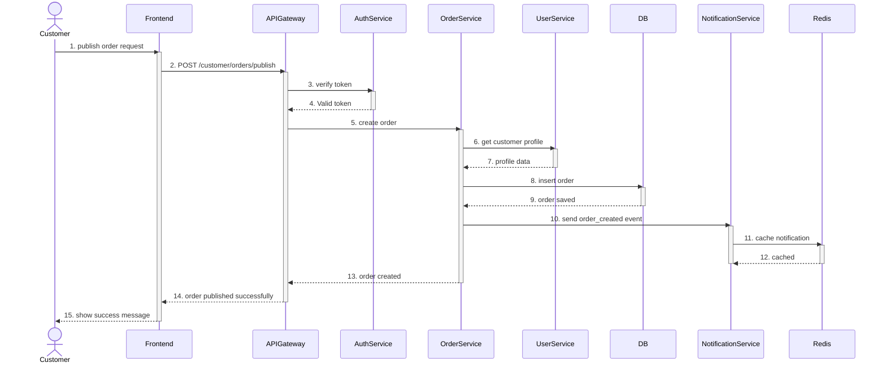
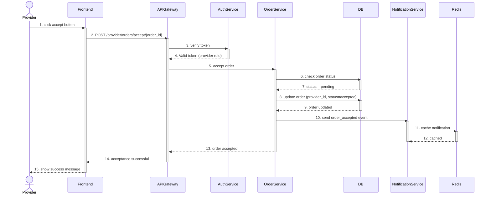
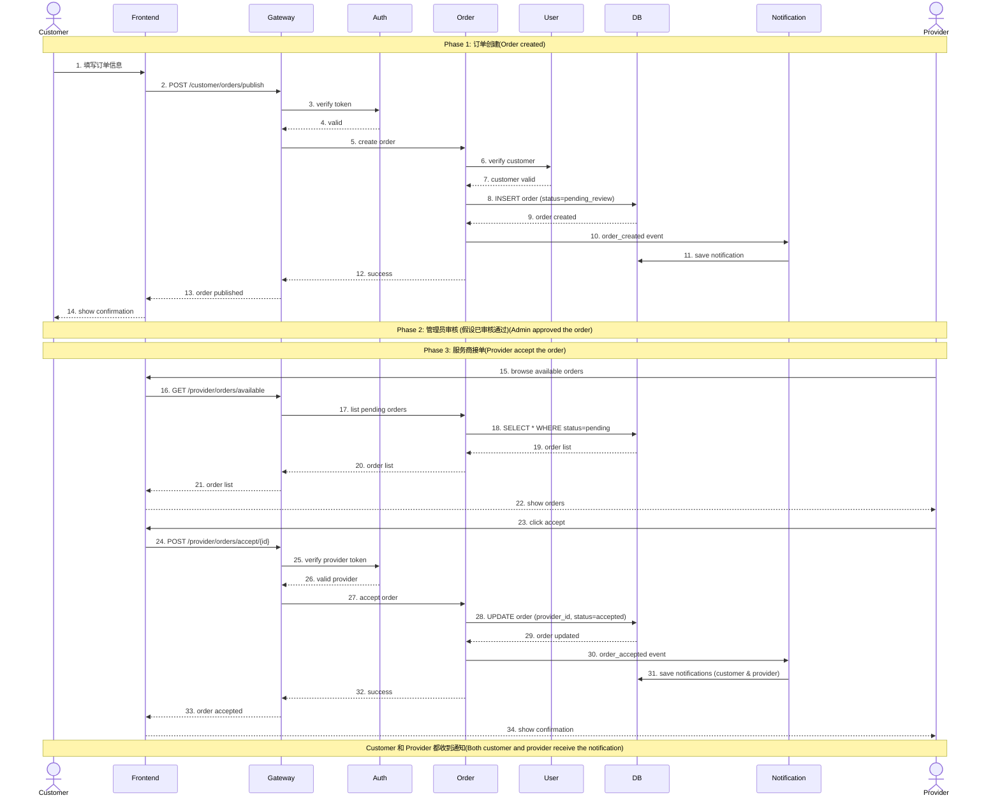

# 系统时序图 (Sequence Diagrams)

## 1. Customer 发布订单流程 (Publish Order)

### 时序图



---

### 流程说明

#### 📋 参与者 (Participants)

| 参与者 | 说明 |
|--------|------|
| **Customer** | 客户端用户（浏览器） |
| **Frontend** | Vue.js 前端应用 |
| **APIGateway** | FastAPI 网关服务（端口 8080） |
| **AuthService** | 认证服务（端口 8000） |
| **OrderService** | 订单服务（端口 8003） |
| **UserService** | 用户服务（端口 8002） |
| **DB** | MySQL 数据库（order_db） |
| **NotificationService** | 通知服务（端口 8006） |
| **Redis** | 缓存服务 |

---

#### 🔄 详细步骤

**Step 1-2: 前端请求**
```javascript
// Customer 在前端填写订单表单并提交
POST /customer/orders/publish
Headers: {
  Authorization: "Bearer <JWT_TOKEN>"
}
Body: {
  "title": "需要清洁服务",
  "description": "家庭深度清洁",
  "service_type": "cleaning_repair",
  "price": 150.00,
  "location": "NORTH",
  "address": "123 Main St",
  "service_start_time": "2025-10-25T10:00:00",
  "service_end_time": "2025-10-25T14:00:00"
}
```

**Step 3-4: Token 验证**
```python
# gateway-service/api/routes.py
@router.post("/customer/orders/publish")
async def publish_order(credentials: HTTPAuthorizationCredentials = Depends(security)):
    await verify_auth_token(credentials)  # 调用 AuthService 验证
```

**Step 5-7: 订单创建与用户验证**
```python
# order-service/services/customer_order_service.py
async def publish_order(db, customer_id, title, description, ...):
    # 内部可能调用 UserService 验证用户身份
    order = await OrderDAO.create_order(...)
```

**Step 8-9: 数据库写入**
```sql
INSERT INTO orders (
    customer_id, title, description, service_type,
    status, price, location, address, 
    service_start_time, service_end_time, payment_status
) VALUES (
    123, '需要清洁服务', '家庭深度清洁', 'cleaning_repair',
    'pending_review', 150.00, 'NORTH', '123 Main St',
    '2025-10-25 10:00:00', '2025-10-25 14:00:00', 'unpaid'
);
```

**Step 10-12: 异步事件通知**
```python
# order-service/events/publishers/event_publisher.py
event = OrderCreatedEvent(
    order_id=order.id,
    customer_id=customer_id,
    title=title,
    price=price,
    location=location,
    timestamp=datetime.now(UTC)
)
await rabbitmq_client.publish_event(
    exchange_name="order_events",
    routing_key="order.created",
    message=event.model_dump_json()
)

# notification-service 消费事件
await service.send_customer_notification(
    customer_id=data["customer_id"],
    order_id=data["order_id"],
    message=f"You have successfully published the order: {data['order_id']}."
)
```

**Step 13-15: 响应返回**
```json
{
  "success": true,
  "message": "Order published",
  "data": {
    "id": 456,
    "customer_id": 123,
    "title": "需要清洁服务",
    "status": "pending_review",
    "price": 150.00,
    "created_at": "2025-10-24T12:00:00Z"
  }
}
```

---

### 🎯 关键特性

1. **状态初始化**: 订单创建时状态为 `pending_review`，需要管理员审核后变为 `pending` 才能被 Provider 接单

2. **异步通知**: 使用 RabbitMQ 发布 `order.created` 事件，NotificationService 异步消费并发送通知

3. **Token 认证**: 每个请求都需要验证 JWT Token，确保只有登录用户可以发布订单

4. **数据验证**: OrderService 验证用户资料和订单数据完整性

---

## 2. Provider 接受订单流程 (Accept Order)

### 时序图



---

### 流程说明

#### 📋 参与者 (Participants)

| 参与者 | 说明 |
|--------|------|
| **Provider** | 服务商用户（浏览器） |
| **Frontend** | Vue.js 前端应用 |
| **APIGateway** | FastAPI 网关服务（端口 8080） |
| **AuthService** | 认证服务（端口 8000） |
| **OrderService** | 订单服务（端口 8003） |
| **DB** | MySQL 数据库（order_db） |
| **NotificationService** | 通知服务（端口 8006） |
| **Redis** | 缓存服务 |

---

#### 🔄 详细步骤

**Step 1-2: 前端请求**
```javascript
// Provider 在订单列表中点击"接单"按钮
POST /provider/orders/accept/456
Headers: {
  Authorization: "Bearer <PROVIDER_JWT_TOKEN>"
}
```

**Step 3-4: Token 验证（Provider 角色）**
```python
# gateway-service/api/routes.py
@router.post("/provider/orders/accept/{order_id}")
async def accept_order(order_id: int, credentials: HTTPAuthorizationCredentials = Depends(security)):
    await verify_auth_token(credentials)  # 验证 token 且角色为 provider
```

**Step 5-7: 订单状态检查**
```python
# order-service/services/provider_order_service.py
async def accept_order(db, provider_id, order_id):
    order = await OrderDAO.get_order_by_id(db, order_id)
    
    if not order:
        raise HTTPException(status_code=404, detail="Order not found")
    
    if order.status != OrderStatus.pending:
        raise HTTPException(status_code=400, detail="Order has already been accepted!")
```

**Step 8-9: 数据库更新**
```sql
-- 检查订单状态
SELECT id, status, provider_id FROM orders WHERE id = 456;

-- 更新订单
UPDATE orders 
SET provider_id = 789,
    status = 'accepted',
    updated_at = NOW()
WHERE id = 456 AND status = 'pending';
```

**Step 10-12: 异步事件通知**
```python
# order-service/events/publishers/event_publisher.py
event = OrderAcceptedEvent(
    order_id=order_id,
    customer_id=order.customer_id,
    provider_id=provider_id,
    timestamp=datetime.now(UTC)
)
await rabbitmq_client.publish_event(
    exchange_name="order_events",
    routing_key="order.accepted",
    message=event.model_dump_json()
)

# notification-service 消费事件
# 通知客户
await service.send_customer_notification(
    customer_id=data["customer_id"],
    order_id=data["order_id"],
    message=f"Your order: {data['order_id']} has been accepted by provider: {data['provider_id']}."
)

# 通知服务商
await service.send_provider_notification(
    provider_id=data["provider_id"],
    order_id=data["order_id"],
    message=f"You have successfully accepted order: {data['order_id']}."
)
```

**Step 13-15: 响应返回**
```json
{
  "success": true,
  "message": "Order accepted",
  "data": {
    "id": 456,
    "customer_id": 123,
    "provider_id": 789,
    "title": "需要清洁服务",
    "status": "accepted",
    "price": 150.00,
    "updated_at": "2025-10-24T13:00:00Z"
  }
}
```

---

### 🎯 关键特性

1. **原子性操作**: 订单接受操作使用数据库事务，确保 `provider_id` 和 `status` 同时更新

2. **状态检查**: 只有 `status = pending` 的订单可以被接受，防止重复接单

3. **双向通知**: 同时通知 Customer（订单被接受）和 Provider（接单成功）

4. **角色验证**: 只有 Provider 角色的用户才能接单

---

## 3. 完整订单生命周期流程



---

## 4. 数据库状态变化

### Order 表状态流转

```
┌─────────────────────┐
│  pending_review     │  ← 初始状态（Customer 发布订单）
│  (待管理员审核)      │
└──────────┬──────────┘
           │ admin approve
           ↓
┌─────────────────────┐
│  pending            │  ← 可被 Provider 接单
│  (等待服务商)        │
└──────────┬──────────┘
           │ provider accept
           ↓
┌─────────────────────┐
│  accepted           │  ← Provider 已接单
│  (已接单)            │
└──────────┬──────────┘
           │ provider start
           ↓
┌─────────────────────┐
│  in_progress        │  ← 服务进行中
│  (进行中)            │
└──────────┬──────────┘
           │ provider complete
           ↓
┌─────────────────────┐
│  completed          │  ← 服务完成
│  (已完成)            │
└──────────┬──────────┘
           │ customer review
           ↓
┌─────────────────────┐
│  reviewed           │  ← 已评价
│  (已评价)            │
└─────────────────────┘
```

---

## 5. 事件驱动通知

### RabbitMQ 事件流

```
Order Service                      RabbitMQ                    Notification Service
     │                                │                               │
     ├─ publish ──────────────────>  │                               │
     │  order.created                │                               │
     │                                ├─ route ────────────────────> │
     │                                │  (order_queue)               │
     │                                │                               ├─ consume
     │                                │                               ├─ send email
     │                                │                               ├─ save to inbox
     │                                │                               │
     ├─ publish ──────────────────>  │                               │
     │  order.accepted               │                               │
     │                                ├─ route ────────────────────> │
     │                                │  (order_queue)               │
     │                                │                               ├─ consume
     │                                │                               ├─ send email (customer)
     │                                │                               ├─ send email (provider)
     │                                │                               ├─ save to inbox x2
```

---

## 6. API 端点总结

### Customer 订单相关 API

| 方法 | 端点 | 说明 | 认证 |
|------|------|------|------|
| POST | `/customer/orders/publish` | 发布订单 | ✅ Customer |
| GET | `/customer/orders` | 获取我的订单列表 | ✅ Customer |
| GET | `/customer/orders/my/{order_id}` | 获取订单详情 | ✅ Customer |
| POST | `/customer/orders/cancel/{order_id}` | 取消订单 | ✅ Customer |

### Provider 订单相关 API

| 方法 | 端点 | 说明 | 认证 |
|------|------|------|------|
| GET | `/provider/orders/available` | 浏览可接订单 | ✅ Provider |
| GET | `/provider/orders/available/{order_id}` | 查看订单详情 | ✅ Provider |
| POST | `/provider/orders/accept/{order_id}` | 接受订单 | ✅ Provider |
| GET | `/provider/orders/my` | 获取我的订单列表 | ✅ Provider |
| POST | `/provider/orders/status/{order_id}` | 更新订单状态 | ✅ Provider |

---

## 7. 错误处理

### 常见错误场景

#### 发布订单失败

```json
// Token 无效
{
  "success": false,
  "error": "Invalid or expired token",
  "status_code": 401
}

// 缺少必填字段
{
  "success": false,
  "error": "Missing required field: service_type",
  "status_code": 400
}
```

#### 接受订单失败

```json
// 订单不存在
{
  "success": false,
  "error": "Order not found",
  "status_code": 404
}

// 订单已被接受
{
  "success": false,
  "error": "The order has already been accepted!",
  "status_code": 400
}

// 角色权限不足
{
  "success": false,
  "error": "Only providers can accept orders",
  "status_code": 403
}
```

---

## 8. 性能优化建议

### 缓存策略

```python
# Redis 缓存订单列表（可接订单）
redis_key = f"available_orders:{location}:{service_type}"
cached_orders = await redis.get(redis_key)

if cached_orders:
    return json.loads(cached_orders)

orders = await OrderDAO.get_available_orders(...)
await redis.setex(redis_key, 300, json.dumps(orders))  # 5分钟过期
```

### 数据库索引

```sql
-- 订单状态索引（加速可接订单查询）
CREATE INDEX idx_order_status_location ON orders(status, location);

-- 复合索引（加速 Provider 查询）
CREATE INDEX idx_order_status_service_type ON orders(status, service_type);

-- Customer 订单索引
CREATE INDEX idx_order_customer_status ON orders(customer_id, status);

-- Provider 订单索引
CREATE INDEX idx_order_provider_status ON orders(provider_id, status);
```

---

## 9. 安全考虑

### Token 验证

```python
# 每个请求都验证 JWT Token
async def verify_auth_token(credentials: HTTPAuthorizationCredentials):
    token = credentials.credentials
    # 调用 AuthService 验证
    user_info = await auth_client.verify_token(token)
    return user_info
```

### 角色权限检查

```python
# 只有 Provider 可以接单
if user_info['role'] != 'provider':
    raise HTTPException(
        status_code=403,
        detail="Only providers can accept orders"
    )
```

### 并发控制

```sql
-- 使用数据库行锁防止重复接单
SELECT * FROM orders WHERE id = ? FOR UPDATE;

UPDATE orders 
SET provider_id = ?, status = 'accepted'
WHERE id = ? AND status = 'pending';
```

---

## 10. 监控指标

### 关键业务指标

| 指标 | 说明 | 告警阈值 |
|------|------|---------|
| **订单创建成功率** | 成功创建订单数 / 总请求数 | < 95% |
| **订单接受响应时间** | 从点击接单到成功的平均时间 | > 2s |
| **事件消费延迟** | 事件发布到通知发送的时间差 | > 5s |
| **数据库连接池使用率** | 活跃连接数 / 最大连接数 | > 80% |
| **Token 验证失败率** | 验证失败次数 / 总验证次数 | > 1% |

---

## 总结

本文档详细描述了 ms-freelancer 项目中 Customer 发布订单和 Provider 接受订单的完整时序流程，包括：

✅ **完整的交互流程** - 从前端到后端各层的详细调用关系  
✅ **实际代码示例** - 基于项目真实代码的实现细节  
✅ **数据库操作** - SQL 语句和状态变化  
✅ **事件驱动架构** - RabbitMQ 消息流转  
✅ **错误处理** - 常见错误场景和解决方案  
✅ **性能优化** - 缓存、索引、并发控制  
✅ **安全考虑** - 认证、授权、防重复  

所有流程图和代码示例都基于项目的实际实现，可直接用于技术文档和团队培训。
